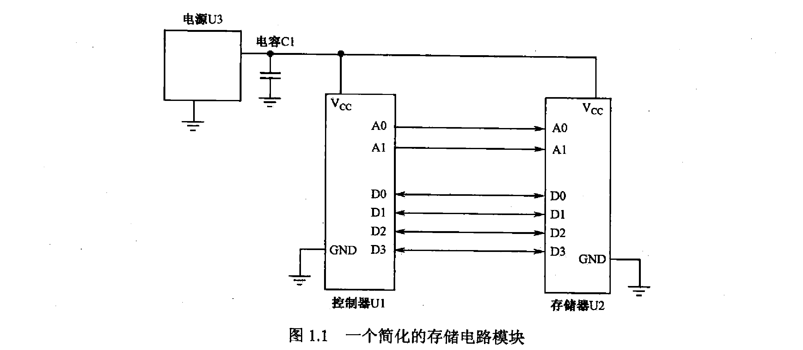
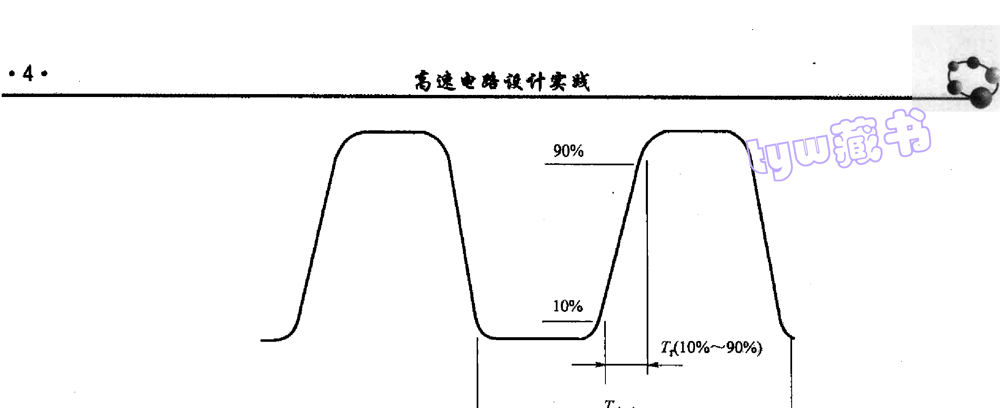
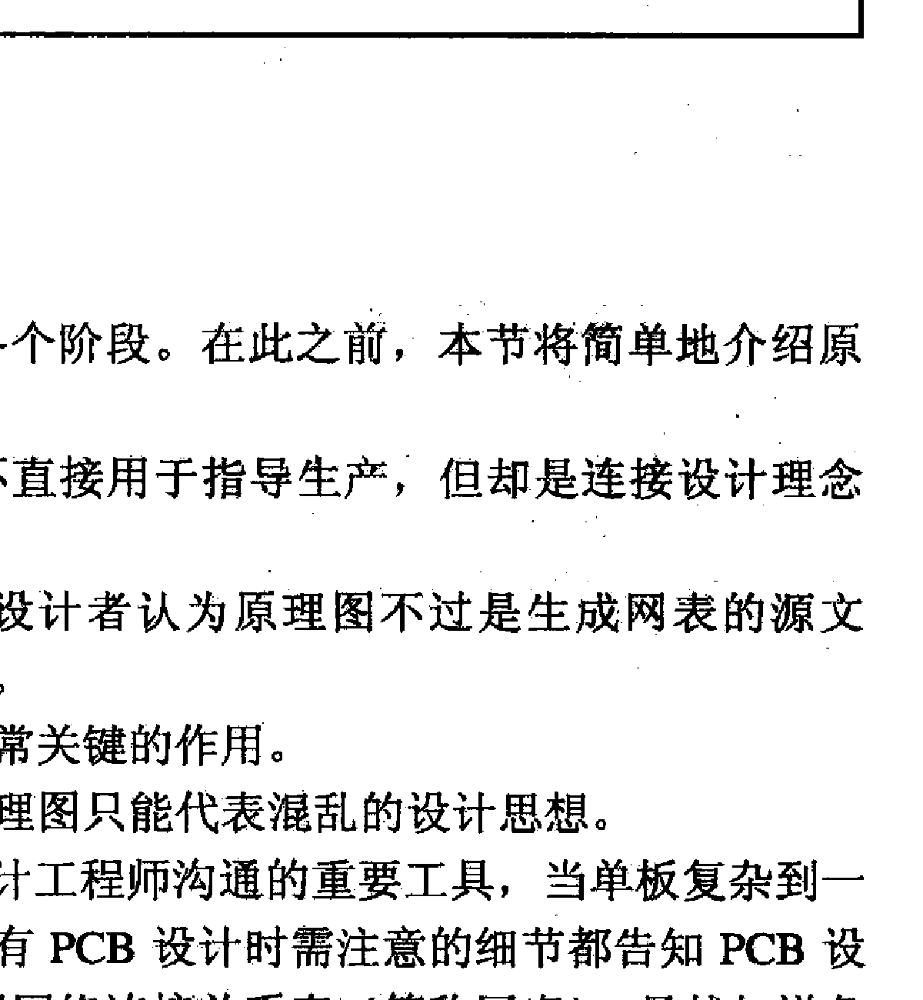
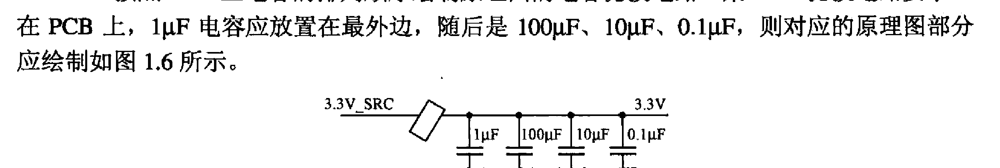

# 第1章 概述

> **本章核心**: 通过低速与高速设计的对比，了解高速电路设计的思维方式(分布式系统 vs 集总式系统)，掌握高速信号的判定方法，理解硬件设计的完整流程及原理图设计规范。

---

## 1.1 低速设计与高速设计的例子

### 【案例 1-1】简化的存储电路模块

下图是一个典型存储模块的简化原理图(见原书第12页 图1.1)。该电路包含:
- **控制器U1**: 通过地址线(A0, A1)和数据线(D0-D3)与存储器通信
- **存储器U2**: 存储数据，通过 8 位总线与 U1 交换数据
- **电源U3**: 为 U1 和 U2 供电
- **去耦电容C1**: 并联在电源与地之间，为 U1/U2 提供瞬态电荷缓冲

对于同样的电路结构，因应用需求不同，有两种截然不同的设计思路。

---

#### 1.1.1 低速设计

**场景**: 机床台面振动监测系统，每 20ms 采样一次，每分钟处理 3000 个数据，数据处理在 1s 内完成。采样速率 50Hz，数据传输速率极低。

**功耗分析与电源选型**:

选择 51 单片机(主频 12MHz) + 小容量 RAM。设计者需先核算总功耗:

- U1(51单片机)全速运行最大功耗: **140mW**
- U2(小容量RAM)全速运行最大功耗: **60mW**
- 总功耗: $140mW + 60mW = 200mW$
- 按 20% 降额裕量: 电源需提供 $200mW \times 1.2 = 240mW$
- 若 Vcc = 5V，则最小供电电流: $240mW / 5V = 48mA$

**U3 选型分析**: LDO 7805。原因:
1. 总电流需求仅约 50mA，而 7805 可输出 1A，裕量充足
2. 低速系统中对电源纹波和效率要求不高，LDO 的低成本、低噪声优势明显
3. 电路简单，外围仅需输入输出电容即可工作

**C1 选型分析**: 100μF 钽电容。原因:
1. 51 单片机为低功耗器件，工作时电流变化幅度小，100μF 的电荷缓冲足以平滑电压波动
2. 钽电容温度稳定性好，适合工业环境(机床振动监测)
3. 相比铝电解电容，钽电容 ESR 更小(约几百 mΩ)，高频响应更好
4. 容量选择依据: 经验法则 — 每 100mA 电流需求配 100μF 左右，本例 50mA 用 100μF 有足够余量

**低速设计逻辑总结**:

这是一个典型的**集总式系统**设计。信号速率为 50Hz，走线长度远小于信号波长的 1/6，因此传输线上各点电位可视为相同，无需考虑传输线效应。设计者只需关注:
1. 总功耗是否在电源供电能力范围内(已核算 200mW 总功耗，选 7805 留 20% 裕量)
2. 电容容值能否提供足够的电荷缓冲(100μF 满足 50mA 瞬态需求)
3. 器件间逻辑电平是否兼容(51 单片机与 RAM 直接接口)

这套设计的核心思维是"够用就好"，不做无谓的过度设计。

#### 1.1.2 高速设计

**场景**: 三层以太网交换机主控板，支持 12 个 GE 口，需处理大量数据包。

**功耗分析与电源选型**:

选择 Freescale PowerPC MPC8547(1.3GHz) + 1GB DDR2 SDRAM DIMM(667Mbps)。功耗需求:

- MPC8547 是高性能通信处理器，典型功耗约 5W~10W(取决于工作频率和外设使用)
- DDR2 SDRAM DIMM 功耗约 2W~3W
- 总功耗远高于低速方案，如以 10W 计，5V 下需 2A 电流，无法用 LDO(压降 × 电流 = 巨大发热)

**U3 选型分析**: DC/DC 开关电源芯片。原因:
1. 功率需求大，DC/DC 效率(85%~95%)远高于 LDO，减少发热
2. 1.8V 输出，若用 LDO 从 5V 降至 1.8V，效率仅 36%，功耗浪费严重
3. DC/DC 可配合电感、MOSFET 等实现大电流输出

注意: DC/DC 电源的输出纹波(几十 mV)比 LDO 大，需要配合足够的滤波电容。

**C1 选型分析**: 220μF 钽电容，6.3V 额定电压，2412 封装，低 ESR。

为什么选 220μF 而不是低速的 100μF?
1. 高速处理器瞬态电流变化幅度大(几十 ns 内电流可跳变数 A)，需要更大的电荷池
2. 钽电容 ESL 小(表贴封装)，高频性能好，适合高速电路
3. 6.3V 额定电压: 工作电压 1.8V，降额因子 1.8/6.3 = 28.5%，满足钽电容不低于 50% 降额的要求
4. 2412 封装比 1206 更扁更长，ESL 更小，高频滤波效果更好
5. 10% 精度: 电源滤波电容要求容值偏差小，确保滤波性能稳定
6. 低 ESR: 减小电容自身发热，提高瞬态响应速度

**额外去耦电容分析**:

在每个 Vcc 引脚就近放置 0.1μF 或 1μF 陶瓷电容:
1. 陶瓷电容 ESL 极小(表贴 0402 封装的 ESL 约 0.5nH)，谐振频率高(>100MHz)，能滤除高频噪声
2. 0402 封装体积小，可紧贴芯片引脚放置，缩短去耦回路，降低寄生电感
3. X7R 类型: 温度稳定性好(-55°C ~ +125°C 范围内容值变化 ±15%)，适合交换机长时间运行
4. 10V 额定电压: 工作电压 1.8V，留足降额余量

**高速设计逻辑总结**:

这是一个**分布式系统**设计。信号速率高达 667Mbps，走线长度可能超过信号有效波长的 1/6，必须考虑传输线效应。相比低速设计，额外关注:
1. **电源架构**: 大电流 → DC/DC 而非 LDO，否则效率低、发热大
2. **多层次滤波**: 主电容(220μF 钽)提供低频电荷池 + 多个小陶瓷电容(0.1μF/1μF)提供高频去耦
3. **去耦布局**: 电容必须就近 Vcc 引脚放置，缩短高频回路
4. **器件兼容性**: 高速逻辑电平(LVPECL/CML)可能需要桥接，不能直接接口
5. **时序与 PCB**: 走线长度直接影响时序裕量，还需考虑阻抗匹配、EMC 等

> **核心区别**: 低速设计用集总式思维(集中到一点分析)，高速设计用分布式思维(传输路径上各点状态不同)，且功耗、电源、滤波等维度的设计要求都更高。

---

## 1.2 如何区分高速和低速

### 两个常见误区

**误区1**: 信号周期频率 $F_{clock}$ 高的才属于高速设计。

实际上需要考虑的是**信号的有效频率**(或称转折频率 $F_{knee}$)。

**误区2**: 电容、电感是理想的器件。

在高速领域，电容含 ESL/ESR，电感含分布电容，不再纯粹。

波形示意图见原书第15页 图1.2: 一个数字信号波形，标注了时钟周期 $T_{clock}$ 和 10%~90% 上升时间 $T_r$。

### 关键公式

波形示意图见原书第15页 图1.2。

$T_{clock}$: 信号时钟周期

$T_r$: 信号 10%~90% 上升时间

周期频率:
$F_{clock} = 1 / T_{clock}$

有效频率:
$F_{knee} = 0.5 / T_r$

> 以 100MHz 时钟为例，假设上升沿为周期的 7%，则 $F_{knee} \approx 700MHz$ -- 远高于周期频率。

信号波长与频率的关系:
$\lambda = c / F$

其中 $c$ 为信号在 PCB 上的传输速度(略低于光速)。

### 判定高速/低速的步骤

1. **获取**信号的有效频率 $F_{knee}$ 和走线长度 $L$

2. **计算**信号的有效波长 $\lambda_{knee}$

3. **判定**: 若 $L > \lambda_{knee} / 6$，则为**高速信号**(需按传输线处理)

**几点注意**:
- 信号最高频率成分取决于**有效频率** $F_{knee}$，而不是周期频率 $F_{clock}$
- 对极高频信号(1GHz 以上)，上升沿可能达周期的 20%，$F_{knee}$ 计算已无意义
- 高速信号指**传输路径上各点电平存在较大差异**的信号
- 区分高速与低速，不仅取决于频率，还取决于**传输路径长度**
- 频率越高，高速/低速分水岭的信号线长度越短

---

## 1.3 硬件设计流程

硬件设计分六个阶段: **需求分析 → 概要设计 → 详细设计 → 调试 → 测试 → 转产**

### 1.3.1 需求分析

最关键的一步，充分理解客户需求。

**与硬件相关的五类需求**:
1. **整体性能**: 数据包转发能力、处理延时、最高带宽、CPU 处理能力
2. **功能要求**: QoS、以太网协议等
3. **成本要求**: 计算单板总成本，有时需计算**单接口成本**
4. **用户接口**: 接口种类/数目、指示灯规范、复位键、电源按钮等
5. **功耗要求**: 电源架构设计重要依据

**需求分析报告示例**(见原书第17页 表1.1):

> 需求分析是制定设计大方向，不能忽略细节，也不能拘泥于细节。应由项目经理、系统工程师、电子/软件/逻辑工程师等协作完成。

### 1.3.2 概要设计

硬件概要设计的主要任务:
- 设计**系统框图、关键链路连接图、时钟分配框图**
- 制定**电源设计总体方案**
- 对 SI、EMC、结构散热、测试可行性做初步分析

> 需求分析和概要设计是**螺旋形前进并反复**的过程。

### 1.3.3 详细设计

基于概要设计的框架，将每一部分细化。**11 个工程师角色协同工作**:

| 角色 | 主要职责 |
|------|----------|
| 电子设计工程师 | 总线信号定义、CPU空间分配、时钟/复位拓扑、原理图绘制、BOM |
| PCB 设计工程师 | 根据原理图 + 网表 + 走线规则，完成 PCB 设计 |
| 信号完整性工程师 | PCB 层叠设计、前/后仿真、走线规则定义 |
| 逻辑设计工程师 | 逻辑器件代码编写及仿真 |
| 电源设计工程师 | 电源器件选型、电源架构设计 |
| 结构工程师 | PCB 机械图、限布区/限高区、安装孔 |
| 热设计工程师 | 热仿真、散热片选型、风道规划 |
| EMC 及防护设计工程师 | 高速信号走线规则、接口防护方案 |
| 测试工程师 | 边界扫描、ICT、硬件测试 |
| 产品工程师 | 可生产性检查，物料状况确认 |
| 软件工程师 | 与硬件协同，确定 CPU 速率、复位逻辑、中断拓扑 |

> 电子设计工程师是协调核心，其输出是其他各角色的输入，其他角色的输出又成为电子设计工程师的输入。

### 1.3.4 调试

首次回板后的调试顺序:

1. **验证电源短路**: 各电源是否与 GND 短路，电源之间是否短路
2. **可编程器件程序加载**
3. **功能模块调试**: 电源电路、逻辑设计、时钟和复位电路可并行进行
4. **流量测试**: 验证各电路协调工作，包括正常流量 + 异常情况模拟

### 1.3.5 测试

**测试计划主要内容**(10 项):
1. 测试设备列表
2. 测试环境搭建图
3. 电源测试(电压、电流、纹波、噪声、上下电顺序)
4. 各接口信号的 SI 与时序
5. 通用接口功能测试
6. 复位链路测试
7. 时钟测试(频率、上升/下降边沿、温漂)
8. 指示灯/在位信号/槽位号等杂项
9. 流量测试
10. 强度测试(电源监控、极限环境、接口标准验证)

> 不推荐用示波器测时钟频率，应使用专门的频率测试仪。

### 1.3.6 转产

- 将生产资料移交给工厂
- ICT 测试夹具和代码应在此阶段提供
- 电子设计工程师负责向工厂测试人员传授单板知识和测试技能

> 一个成功的硬件设计是一个有机的整体，需要多部门工程师协调工作，任何一个环节出错都可能导致整个设计的失败。

---

## 1.4 原理图设计

原理图不仅是生成网表的源文件，更是连接设计理念和最终产品的纽带。**10 条规范**:

### (1) 首页绘制总体框架图
复杂单板还需补充: 电源架构框图、时钟拓扑图、复位链路拓扑图、中断链路拓扑图、边界扫描链路图、面板图示、I2C 器件地址图。

### (2) 电源输出端标注电压和电流值
有助于 PCB 工程师决定哪些支路需加粗走线、增加过孔。

(见原书第22页 图1.3: 3.3V电源分出四路3.3V_1~3.3V_4，分别标注200mA/50mA/800mA/100mA)

### (3) 标注关键电流通路
在原理图上标注大电流路径(如 MOSFET 源极-漏极通路)，提示 PCB 工程师做加宽走线、增加过孔等处理。例如 3.3V 电源主通路电流达 5A，应在原理图上标注 "3.3V_SRC 与 3.3V 为电流关键路径"。(见原书第22页 图1.4)

### (4) 绘制兼顾 PCB 布放位置
- 始端匹配电阻应靠近发送端
- 终端匹配电阻应靠近接收端
- 不同页时，匹配电阻放在接收端那一页(见原书第23页 图1.5)

### (5) 电容滤波电路按 PCB 排列顺序绘制
PCB 上 1μF 在最外边，100μF ~ 10μF ~ 0.1μF，原理图也应同序。

(见原书第23页 图1.6: 3.3V_SRC经保险管后依次排列1μF、100μF、10μF、0.1μF四个并联电容到地)

### (6) 标注关键信号速率、走线层
信号线之间的走线长度关系也建议标注。

### (7) 标明高散热及热敏感器件
若有特殊放置要求，在原理图上注释。

### (8) 关键器件标料号、精度、尺寸
包括: 保险管、分压电阻、电源滤波用电感/磁珠/电容、MOSFET、二极管、电压采样电阻等。

### (9) 跳线、选焊器件的配置方法注释

### (10) 标注连接器、LED 指示灯的排列顺序

> 优质的原理图 = 设计思想的体现 + PCB 工程师的沟通工具 + 调试测试效率的保障。

---

## 本章小结

| 知识点 | 要点 |
|--------|------|
| 高速 vs 低速 | 分布式 vs 集总式，取决于 Fknee 和走线长度 |
| 硬件设计流程 | 6 阶段，多角色协同 |
| 原理图规范 | 10 条，兼顾可读性、可生产性和可测试性 |
| 核心思维 | 高速设计本质是处理**传输路径上的分布效应**，以及**器件非理想特性** |
