# 第2章 高速电路中的电阻、电容、电感和磁珠的选型及应用

> **本章核心**: 掌握高速电路中最常用四种元器件的选型和应用要点，通过真实故障案例理解错误选型带来的后果。

---

## 2.1 电阻的应用

### 📌 经典案例

#### 【案例 2-1】串联电阻过大导致板间告警失败

**电路描述**:

业务板上的电源监控芯片检测到电源异常时，通过告警信号线(ERR)将低电平信号经由背板传递到主控板。主控板上的 74LVTH16244 逻辑芯片接收该信号，处理后触发 CPU 中断。

由于单板支持热插拔，告警信号与背板连接器之间串有电阻: 业务板侧 R1=1kΩ，主控板侧 R2=100Ω、R3=1kΩ。

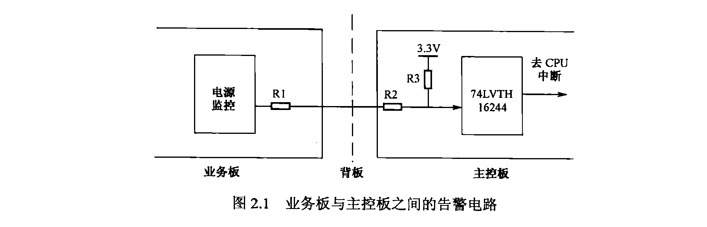

**现象**: 强制将业务板被监控电源拉地，CPU 中断信号不使能。

**根因分析**:

74LVTH16244 为高阻抗输入，当监控芯片输出低电平(0V)时，主控板输入端的电平由 R3 与 R1+R2 分压决定:

$V_{in} = 3.3V \times \frac{R_1+R_2}{R_1+R_2+R_3} = 3.3V \times \frac{1k\Omega + 100\Omega}{1k\Omega + 100\Omega + 1k\Omega} = 3.3V \times \frac{1.1k\Omega}{2.1k\Omega} \approx 1.73V$

1.73V 远高于 74LVTH16244 的低电平输入门限(典型值 0.8V)，所以 CPU 无法识别告警。

**解决**:

将 R1 从 1kΩ 改为 33Ω:

$V_{in} = 3.3V \times \frac{33\Omega + 100\Omega}{33\Omega + 100\Omega + 1k\Omega} = 3.3V \times \frac{0.133k\Omega}{2.133k\Omega} \approx 0.38V$

0.38V 处于低电平门限(≤0.8V)内，告警功能恢复正常。

> 注意: 不能通过增大 R3 来进一步降低电平，因为逻辑器件实现电平翻转时有最小电流要求，R3 过大可能导致输入电流不足(详见第3章)。

**教训**: 多板协同设计时，每块单板单独看都没有问题，但接口组合后产生分压效应。设计背板接口电路必须考虑本板与其他单板的协同工作。

#### 【案例 2-2】电阻额定功率不够造成的单板潜在缺陷

**电路描述**:

PHY 芯片(以太网物理层芯片)的内核电源(VCC_CORE)对噪声特别敏感，设计中使用 LC 滤波后再串联一个 1Ω 电阻 R，用做全频段衰减器(不仅能滤高频噪声，也能衰减低频噪声)。

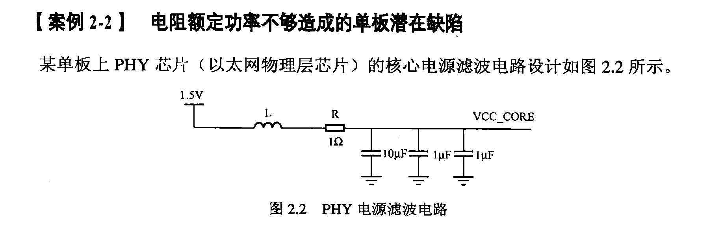

**现象**: 单板长时间运行后，电阻 R 频繁爆裂。

**根因分析**:

- 电阻 R 采用 0402 封装，额定功率 1/16W
- 该电阻的最大通流能力: $I_{max} = \sqrt{P/R} = \sqrt{0.0625W / 1\Omega} = 0.25A$
- PHY 芯片内核最大功耗 300mW @ 1.5V，意味着最大电流:

$I = P / V = 300mW / 1.5V = 200mA$

即 PHY 全速工作时，电阻上的实际功率为:

$P = I^2 \times R = (0.2A)^2 \times 1\Omega = 0.04W$

虽然 0.04W < 0.0625W(额定功率)看起来满足，但 200mA > 62.5mA(额定电流的估算),而且 0402 电阻的散热能力差，长时间运行热量累积导致失效。

实际上，0402 封装 1/16W 电阻按 62.5mA 最大电流计算已远超，PHY 内核 200mA 电流是安全的 3 倍以上。

**关于品质因数 Q 的讨论**:

这个电路中的电阻 R 除了全频段衰减外，还有一个重要作用——**降低电路的品质因数 Q**。

$Q$ 的定义: 回路谐振时，储存能量与一周期内消耗能量之比。对于一个 RLC 串联电路:

$Q = \omega_0 L / R = 1 / (\omega_0 C R) = (1/R) \times \sqrt{L / C}$

不同 Q 值的幅频特性如下图所示:

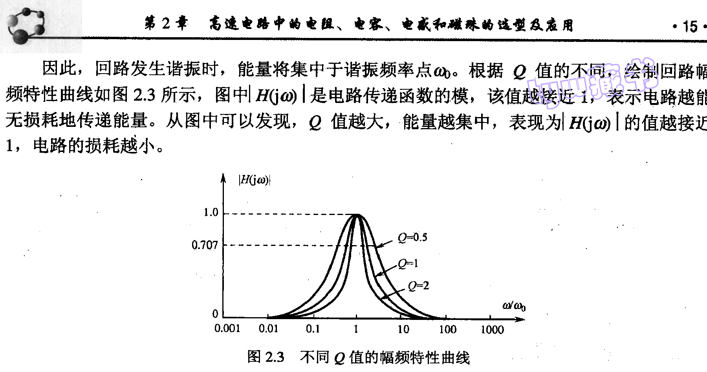

从上图可见:
- **Q 值大**: 能量集中于谐振频率附近，曲线陡峭。在选频电路(如滤波器)中希望 Q 大，选频特性好
- **Q 值小**: 能量分散，曲线平缓。在电源或信号线路中希望 Q 小，避免谐振引起的振铃和失真

本案例中，串联电阻 R 降低了 RLC 回路的 Q 值，防止电源线路因谐振产生振荡。如果只用 LC 滤波而不串电阻，LC 储能元件可能产生自激振荡，使电源噪声反而增大。

**解决**: 更换为额定功率足够的电阻(如 0603 或更大封装)，同时兼顾阻值精度。

**教训**: 
1. 电阻选型不仅要关注阻值，额定功率(额定电流)至少降额 20%
2. 串联在电源路径上的电阻还起到降低 Q 值、防止谐振的作用
3. 电阻的失效可能不会立即暴露，需要通过长时间老化测试发现

#### 【案例 2-3】0Ω 电阻在时序设计中的妙用

**电路描述**:

FPGA 需要兼容两个厂家的存储器(A 和 B)，两者引脚定义完全相同，但时序参数有差异。经时序计算，B 厂家的时钟信号线需要比 A 厂家长 600mil 才能满足建立/保持时间。

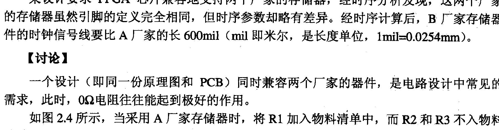

**解决方案**: 使用 0Ω 电阻 + PCB 走线实现兼容:

- 使用 **A 厂家存储器**时: 焊接 R1，R2/R3 不上件。时钟信号经 R1 直接到达 A 存储器
- 使用 **B 厂家存储器**时: 不焊 R1，焊接 R2 和 R3。时钟信号经 R2 → 600mil 走线 → R3 到达 B 存储器，利用 600mil 走线长度补偿时序差

**PCB 设计要点**:

1. R2 需紧靠 R1 左侧引脚放置，R3 紧靠 R1 右侧引脚放置——减少时钟信号线上可能出现的分叉(stub)
2. R2 与 R3 之间的 PCB 走线长度为 600mil

对于信号速率极高、不允许存在分叉的设计，可以采用更先进的方式:

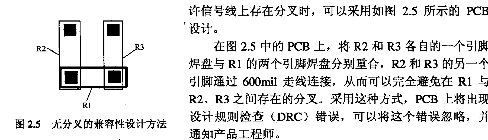

PCB 上将 R2 和 R3 各自的一个引脚焊盘与 R1 的两个引脚焊盘分别重合，R2 和 R3 的另一个引脚通过 600mil 走线相连。这种方式完全避免了分叉，但会产生 DRC(设计规则检查)错误，需手动忽略并通知产品工程师。

**教训**: 0Ω 电阻搭配 PCB 走线是实现多方案兼容的简便手段，但信号速率高时要注意分叉对信号完整性的影响，必要时采用焊盘重合的设计。

---

### 📌 电阻应用要点

高速电路中电阻选型需关注**四个维度**:

| 维度 | 要点 |
|------|------|
| **阻值** | 尽量用常用阻值串并联构成非常用值，避免非标件采购困难且成本高 |
| **尺寸** | EIA 英制代码(如 0603 表示 0.06in×0.03in)与公制代码(1608 表示 1.6mm×0.8mm)，注意区分 |
| **额定功率** | **至少降额 20%**，大电流路径上的电阻必须重点核算。0402 ≈ 1/16W，0603 ≈ 1/10W，0805 ≈ 1/8W |
| **精度** | 电源分压电阻等设定参数的场合必须选 1% 精度，否则输出电压偏差过大 |

**精度应用示例**:

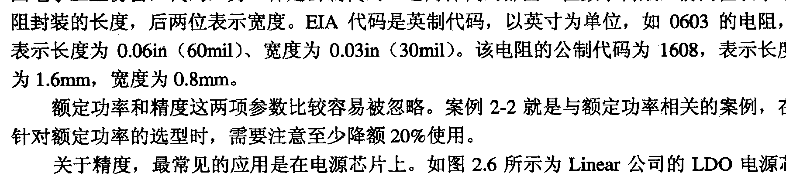

LT3080 的输出电压由外部电阻 $R_{SET}$ 设定。若选 5% 精度的电阻，输出电压波动可达 10%，必须选 1% 精度电阻。即使 1% 精度，仅电阻偏差就导致了 2% 的输出电压偏差。

> **降额原则**: \$P_{实际} \leq P_{额定} \times 80\%$，即实际功率不得超过额定功率的 80%

---

## 2.2 电容的选型及应用

### 经典案例

#### 【案例 2-4】电容失效导致低温下硬盘停止工作

**现象**: -30°C 低温冷启动时，硬盘检测报错。

**根因**: 硬盘 5V 电源滤波使用 47μF 铝电解电容，标称温度范围虽达 -55°C~105°C，但低温下 ESR 急剧增大(约为常温的 2 倍以上)，滤波效果大幅下降，导致 5V 纹波达 800mV。

**解决**: 将铝电解电容更换为同容值的钽电容，低温测试通过。

**教训**: 铝电解电容不宜用于低温环境或对电源质量要求高的场景。

#### 【案例 2-5】多次带电插拔子板导致母板上钽电容损坏

**现象**: 子板热插拔十多次后母板上 12V 滤波钽电容爆裂。

**根因**: 钽电容额定电压 16V，工作电压 12V(降额 25%)，看似足够但热插拔瞬间产生大瞬变电流，击穿钽介质。

**解决**: 更换为铝电解电容。

**教训**: 钽电容耐瞬变电流能力弱，在有热插拔或大电流冲击的场合需降额 70% 以上使用，或改用铝电解电容。

#### 【案例 2-6】电容问题导致 CPU 工作不稳定

**现象**: 大量数据处理时偶发丢包。

**根因**: CPU 锁相环供电 VCC_PLL 引脚仅有一个 10μF/1206 陶瓷电容，纹波达 50mV(含噪声 70mV)，导致锁相环输出时钟边沿产生 1/4 周期偏移，时序不满足。

**解决**: 靠近 VCC_PLL 引脚增加两个 0612 封装的 2.2μF 陶瓷电容和一个 0402 封装的 0.1μF 陶瓷电容。

**教训**: 高速器件的 PLL 等敏感电源引脚，需要就近布置多颗不同容值的滤波电容。

### 电容的三大作用

作用 | 原理 | 应用场景
------|------|--------
**电荷缓冲池** | $\Delta V = \Delta Q / C$，电容吸收/释放电荷稳定电压 | 器件电源引脚去耦
**高频噪声泄放** | $Z = 1/(2\pi f C)$，高频时电容呈低阻抗到地 | 电源滤波、旁路
**交流耦合** | 通交流阻直流，隔离两侧直流偏置 | 高速差分信号互连

### 电容等效电路

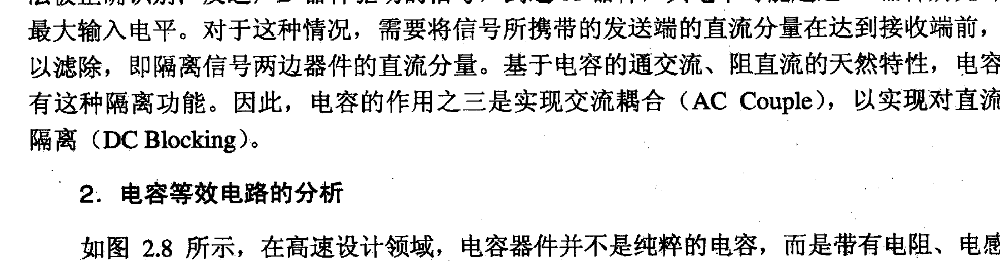

实际电容器件并非理想电容，而是包含寄生参数的小型电路:

$C$ — 电容分量(主导低频特性)
$ESL$ — 等效串联电感(取决于封装，主导高频特性)
$ESR$ — 等效串联电阻(取决于温度、频率)
$R_{leak}$ — 并联泄漏电阻

**阻抗-频率曲线**(浴盆曲线):
- 低频段: 容性主导，阻抗 $= 1/(2\pi f C)$，随频率升高而下降
- 谐振点: 阻抗最小，$f_{res} = 1/(2\pi \sqrt{ESL \times C})$
- 高频段: 感性主导，阻抗 $= 2\pi f \times ESL$，随频率升高而上升

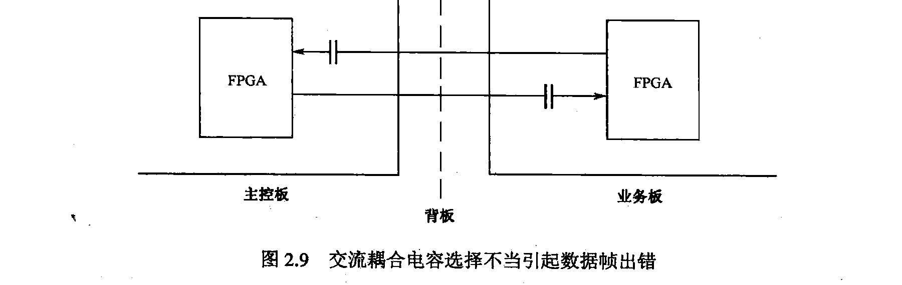

#### 【案例 2-7】交流耦合电容选择不当引起数据帧出错

**现象**: 800Mbps LVPECL 差分信号采用 0.01μF 耦合电容，发送长连 0/连 1 码型时接收端出错。

**根因**: 耦合电容太小，无法维持长连 0/连 1 期间的充放电平衡。计算公式:

$C_{min} = 7.8 \times NUM \times T_b / R$

其中 $T_b$ 为每比特周期(1.25ns)，$NUM$ 为最长连 0/连 1 长度(86)，$R$ 为负载(50Ω):

$C_{min} = 7.8 \times 86 \times 1.25ns / 50\Omega = 16.8nF$

0.01μF < 16.8nF，不满足要求。

**解决**: 改用 0.1μF 耦合电容。

**教训**: 交流耦合电容不能太小(否则连0/连1失真)，也不能太大(影响边沿斜率)。高速设计中一般取 0.1μF。

#### 【案例 2-9】LDO 电源滤波电容 ESR 问题

**现象**: LDO(LT1963)上电时输出 1.5V 出现 1.8V 冲击。

**根因**: 10μF 陶瓷电容 ESR(6mΩ) 太小，无法满足 LDO 芯片对 ESR 的补偿要求(需 ≥ 20mΩ)。

**解决**: 更换为 10μF 钽电容(ESR ≈ 20mΩ @100kHz)。

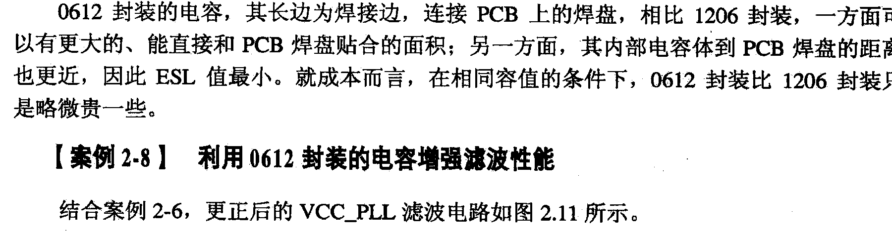
**教训**: 电容 ESR 并非越小越好，某些 LDO 需要利用 ESR 产生电压波动以触发反馈调节。

### 电容器件并联技巧

**两种方法展宽低阻抗频带**:

1. **不同容值 + 不同封装**: 如 1μF/0603 + 0.01μF/0402，各自谐振点不同，拼合出更宽的带宽
2. **同型号并联**: 只能降低谐振点处的阻抗，**不能**展宽低阻抗频带

> 只换容值不换封装没有效果 — 相同封装 ESL 相同，阻抗曲线被大容值电容的曲线完全包含。

#### 【案例 2-11】陶瓷电容选型错误导致丢包

**现象**: 降成本后将交换芯片电源的 10μF 滤波电容从 X7R 改为 Y5V，高温 55°C 下丢包。

**根因**: Y5V 电容在 80°C 时有效容值降至标称值的 40% 以下(仅 3.78μF)。

**解决**: 换回 X7R 类型。

**教训**: Y5V 电容温度稳定性极差，高速电路中应选用 NPO、X7R、X5R，避免使用 Y5V。

### 常用电容类型对比

| 类型 | 优点 | 缺点 | 适用场景 |
|------|------|------|----------|
| **陶瓷电容** | 体积小、价格低、稳定性好、ESR 小 | 容量小 | 高频滤波、去耦 |
| **钽电容** | 温度好、ESL 小、体积小、容量大 | 耐冲击能力弱(需降额 50%~70%) | CPU/大功率器件滤波 |
| **铝电解电容** | 容量大、耐压高 | 温度差、ESR 大、低频 | 低频滤波、缓启电路 |
| **OSCON** | ESR 小、温度好、价低 | 插装、体积大 | 替代钽电容、DC/DC 滤波 |

> 钽电容需特别注意: 感性负载/小串联电阻/大瞬变电流场合，额定电压需降额 70% 以上。

---

## 2.3 电感的选型及应用

### 经典案例

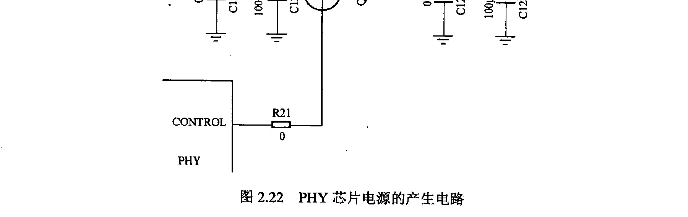

#### 【案例 2-13】LC 低通滤波导致输出电源纹波偏大

**现象**: PHY 芯片外部晶体管产生的 1.5V 电源存在 160mV 纹波。

**根因**: LC 滤波器(L4 + C1225)谐振频率 1.59MHz，恰好处于晶体管工作频段(1~100MHz)内，发生谐振。实际上该电路本身就是 LDO，无需 LC 滤波。

**解决**: 删除 L4，晶体管集电极直连输出。

**教训**: 不要迷信 LC 滤波，先搞清楚电路结构再决定是否需要。

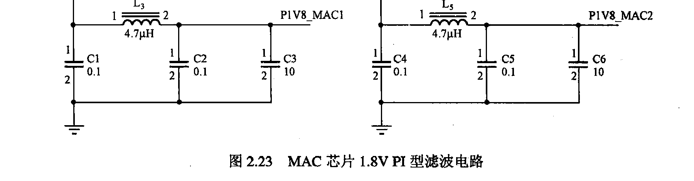

#### 【案例 2-14】大电流通路 PI 型滤波造成电压衰减

**现象**: MAC 芯片 1.8V 电源 P1V8_MAC1(1.67V)和 P1V8_MAC2(1.61V) 低于最低要求 1.62V。

**根因**: 四重电压衰减叠加:
1. 电源模块输出过孔仅一个，通流不足
2. 电源平面路径上被信号过孔阻断，有效宽度从 550mil 缩至 180mil
3. B→D 路径有效宽度仅 95mil
4. 电感 L3/L5 直流电阻造成 0.1V 压降

**解决**: 花焊盘过孔 + 新增过孔 + 其他层增加电源平面 + 低直流电阻电感。

**教训**: 电源平面设计需考虑过孔通流、路径有效宽度、信号过孔的阻断效应等因素，且经验公式结果需降额使用。电源滤波用电感上的压降不可忽视。

### 电感的三大作用

1. **通直流、阻交流**: $Z = j\omega L$，频率越高阻抗越大
2. **阻碍电流变化**: 感应电动势产生反向电流
3. **滤波**: 与电容构成低通滤波器

### 三种电感类型

| 类型 | 电感值范围 | 自谐振频率 | 额定电流 | 适用场景 |
|------|-----------|-----------|---------|---------|
| **高频信号用电感** | 0.6~390nH | >1GHz | 几十~几百 mA | RF 射频信号 |
| **一般信号用电感** | 0.01~1000μH | 几十~几百 MHz | 几~几十 mA | 板间高速信号滤波 |
| **电源用电感** | 1~470μH | 几十 MHz | 几十 mA~几 A | 电源电路滤波 |

**选型要点**:
- 工作频率必须低于自谐振频率(逾越高电感呈容性)
- 信号电感重点考察 Q 值频率特性
- 电源电感重点考察直流电阻(压降)和额定电流

---

## 2.4 磁珠的选型及应用

### 磁珠滤波机理

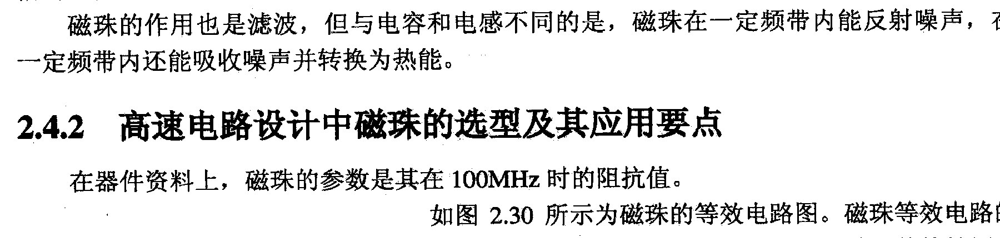

磁珠与电容和电感的滤波机理不同:

- **电容**: 构建低阻抗通路到地，**泄放**噪声(但噪声仍在电路中)
- **电感**: 构建低通滤波器，**反射**高频噪声(噪声仍在)
- **磁珠**: 低频呈感性(反射)，高频呈电阻性(**吸收**噪声并转化为热能)

**转换点频率**: 磁珠阻抗 $Z$ 由电阻成分 $R$ 和电抗成分 $X$ 组成。$R = X$ 处的频率为转换点:
- 低于转换点: 电感性，反射噪声
- 高于转换点: 电阻性，吸收噪声→热能

> 磁珠是耗能器件，不会产生自激;电感是储能器件，与电容配合可能自激。

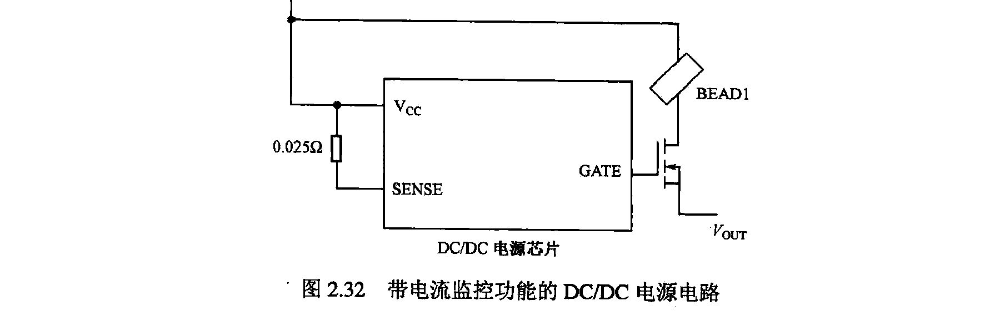

### 【案例 2-15】误用磁珠造成过流保护电路失效

**现象**: 即使将电流检测电阻从 0.025Ω 改为 0.1Ω，也无法触发过流保护。

**根因**: 10V 电源进入单板后分为两路: 一路经电阻到 SENSE 引脚(不耗流)，一路经磁珠后产生 Vout。实际被监控的是不耗流的第一条路径，真正的大电流路径(经磁珠)未被监控。

**解决**: 去掉磁珠，使过流检测路径与电源输出路径一致。

**教训**: 磁珠串入电源路径后，其后的电流不会被电源芯片的电流监控电路检测到。不要盲目使用磁珠。

### 磁珠 vs 电感

| 对比项 | 磁珠 | 电感 |
|--------|------|------|
| 滤波机理 | 吸收噪声→热能 | 反射/转化噪声 |
| 高频性能(>50MHz) | ✅ 好 | ❌ 差 |
| 抗 EMI | ✅ 好 | ❌ 可能辐射干扰 |
| 自激 | ❌ 不会(耗能器件) | ⚠️ 可能(储能器件) |
| 额定电流 | 较小 | 较大 |
| 直流电阻 | 较小 | 较大 |

**共同点**:
- 工作电流都不可超过额定电流
- 都要考虑直流电阻造成的压降
- 选型都要参考频率特性曲线

---

## 本章小结

| 器件 | 选型核心 | 关键参数 |
|------|---------|---------|
| 电阻 | 阻值 + 额定功率 + 精度 + 尺寸 | 四选型维度 |
| 电容 | 容值 + 封装(ESL) + 类型(温度特性) + ESR | 阻抗-频率曲线 |
| 电感 | 电感值 + 自谐振频率 + 直流电阻 + 额定电流 | 频率特性曲线 |
| 磁珠 | 转换点频率 + 额定电流 + 直流电阻 + 谐振频率 | 转换点 = R=X 处频率 |
